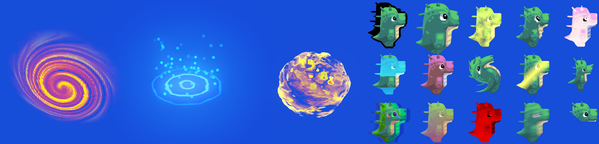
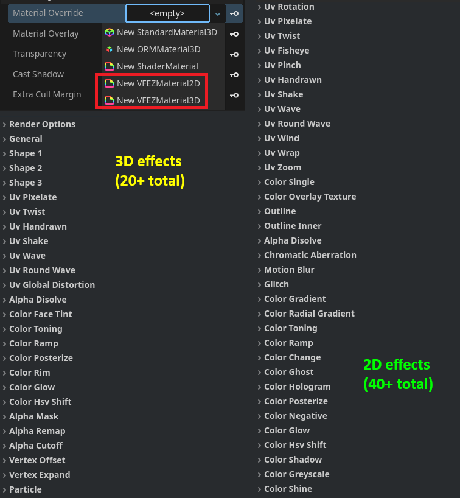

# VFEZ-godot

`VFEZ-godot` is a godot library for easy VFX generation. \
`VFEZ-godot` provides flexible `2D` and `3D` materials that can create complex effects without writing code. \
`VFEZ-godot` was tested in `Godot 4.3` and in `Godot 4.4`.

## Quickstart
To get started with `VFEZ-godot` simply clone the repo inside your project and then create a new `Material`.
* To create a 3D VFX, create a `VFEZMaterial3D` in a `MeshInstance3D` node.
* To create a 2D VFX, create a `VFEZMaterial2D` in a `Sprite2D` or `TextureRect` node.
* `VFEZMaterials` can also be used inside particle systems.
* `VFEZ-godot` contains a big library of shader effects that can be stacked easily together.
* The order of the listed effects corresponds to their execution order inside the shader for more transparent effect stacking.

## Technical details
* A `VFEZMaterial` dynamically recompiles the `Shaders/vfez_template_3d.gdshaderinc` or the `Shaders/vfez_template_2d.gdshaderinc` every time an effect is enabled or disabled. That way the resulting material does not include excess code logic and is performant. 
* Every `VFEZMaterial` generates a unique shader file that contains the definitions (`#define`) of the enabled effects. 
* If you dont want to use the `VFEZMaterial3D` and `VFEZMaterial2D` in your project you can still use the library to stack effects in your custom shaders. You can see the `Shaders/vfez_2d_example.gdshader` and `Shaders/vfez_3d_example.gdshader` as guidelines on how to stack effects manually.

## TODO
* Add more VFEZ effects
* Add more usage tutorials

## Community Notes
* Contributions are welcome (especially new effects to enchance the library!).
* If you encounter any bug let me know so I can fix it.
